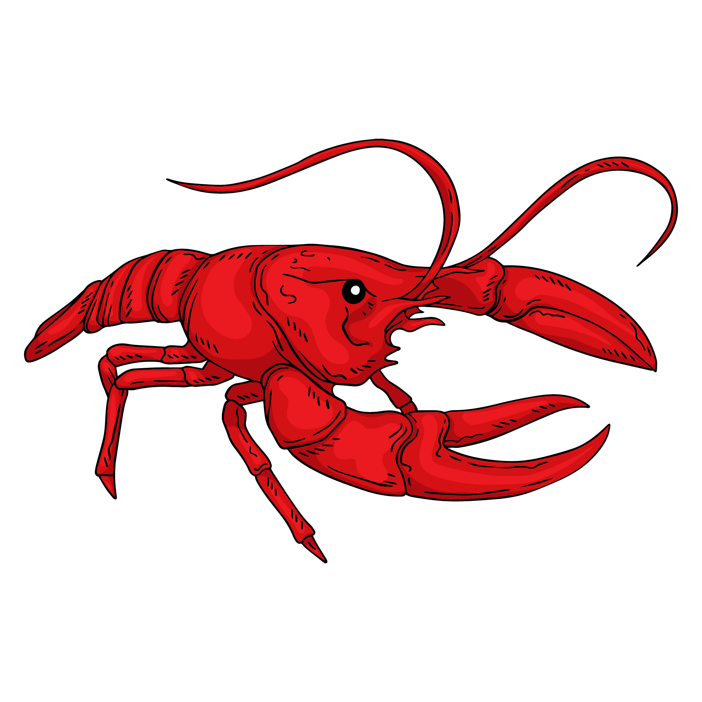
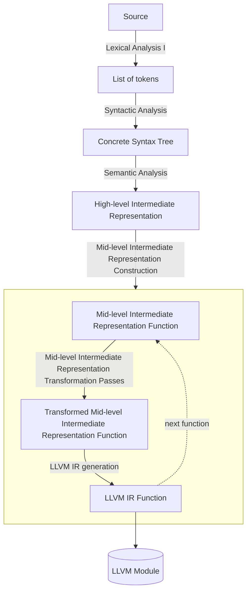
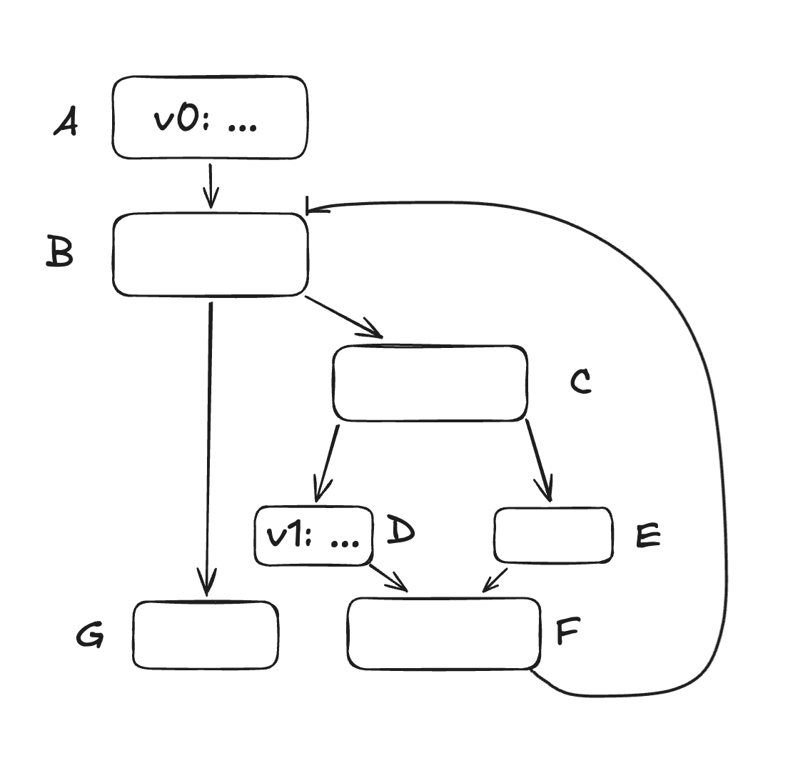
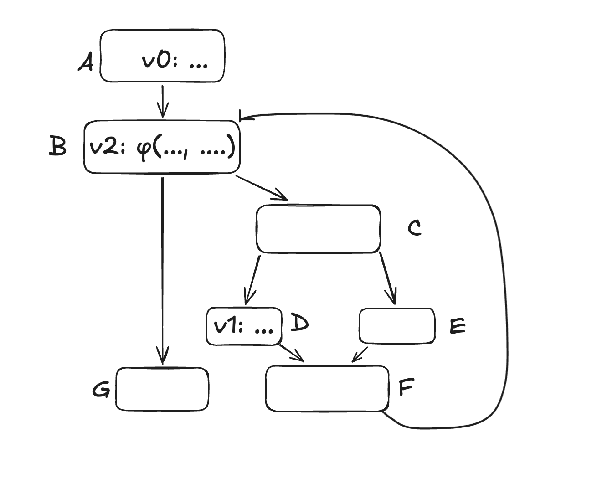
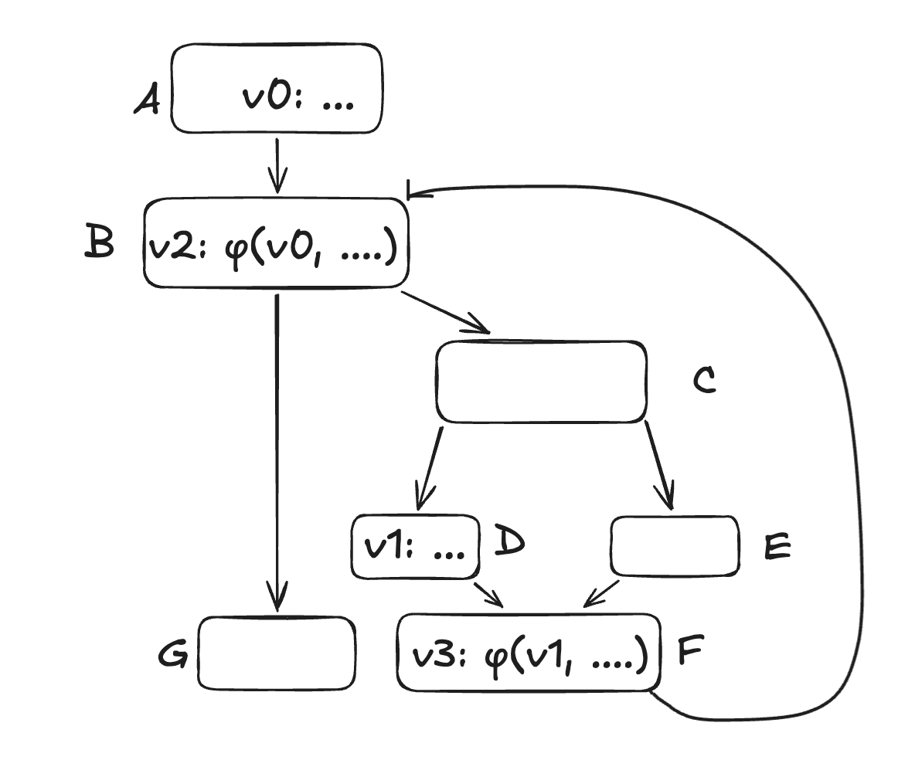
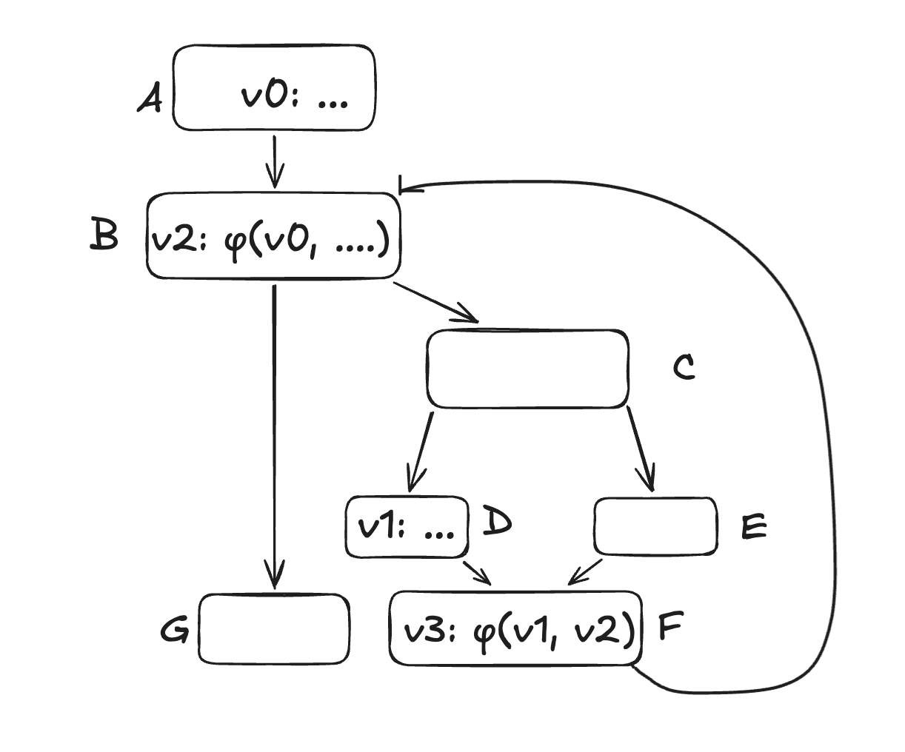

<div align="center">
  
  <h1>crawfish</h1>
  <p>simple and expressive programming language</p>
</div>

> [!CAUTION]
> The compiler can't compile crawfish programs yet.

## Installation (Building from Source)

### Dependencies

- Rust Compiler
- LLVM

### Steps

1. Install Rust
```sh
curl --proto '=https' --tlsv1.2 -sSf https://sh.rustup.rs | sh
```

2. Install `llvm-config-22` and `libpolly-22-dev`
```sh
wget https://apt.llvm.org/llvm.sh
chmod +x llvm.sh
sudo ./llvm.sh 22
sudo apt install libpolly-22-dev
```

3. Git clone the repository

```sh
git clone https://github.com/simontran7/crawfish.git
```

4. `cd` into the `crawfish/` directory, then build the project with GNU Make

```sh
cd crawfish/
cargo build --release
```

5. Move the `target/release/crawfish` binary to a desired location (e.g. in `/Users/<your name>`), then add it to your `PATH` by adding the following line to your `.bashrc` file

```sh
# in your .bashrc
export PATH=$PATH:<path to the crawfish compiler executable>
```

## Usage

Run `crawfish --help` to see available commands and options.

## ARCHITECTURE



### Lexical Analysis

...

### Syntactic Analysis

#### Concrete Syntax Tree

At the loop level, the parser often needs to decide whether to continue parsing, skip the token, or give up. A good error recovery strategy is as follows:
1. Try to parse the expected thing. If successful, continue the loop.
2. If parsing fails, check if the current token is a synchronization point.
3. If yes: break, and let the outer parser handle it. If no: advance past the token, produce an error node for it and a diagnostic, and continue in the loop

> [!NOTE]
> Make the parser always consume at least one token per iteration to avoid infinite loops!

#### Recursive Descent Parsing

Like the lexer, the parser is hand-written (conceptually a pushdown automaton for a context-sensitive language). Specifically, it is a recursive descent parser with Pratt parsing for expressions.

**Recursive descent parsing** is a top-down parsing technique that constructs a parse tree by starting from the root and working downward toward the leaves. It maps every non-terminal in a BNF grammar to a concrete `parse_<non-terminal>()` method. As a recap from theory of computation: a non-terminal is a symbol representing a syntactic category that can be replaced by a sequence of other symbols, while a terminal is a fundamental, indivisible symbol that constitutes the language being defined. Essentially, recursive descent parsing translates the grammar's rules into imperative code (credits to *Crafting Interpreters* for this table):

| Grammar Notation | Code Representation                      |
|------------------|------------------------------------------|
| Terminal         | Code to match and consume a token        |
| Nonterminal      | Call to that rule's function             |
| `\|`              | `if` or `switch` statement              |
| `*` or `+`       | `while` or `for` loop                    |
| `?`              | `if` statement                           |

The `parse()` method iterates through the list of tokens and checks for tokens that may indicate the beginning of a valid top-level declaration. If so, it calls the correct parse method.

> [!NOTE]
> I learned from [this article](https://jhwlr.io/intro-to-parsing/#:~:text=Tokens%20should%20be%20consumed%20by%20the%20node%20which%20they%20belong%20to.) a helpful trick that uniformalizes code: ensure that the parser consumes tokens where they belong, not where they're recognized. For example, we recognize the the `func` keyword in `parse_top*level_item()`, but it gets consumed in `parse_function_definition()` because `func` is part of the function definition's syntax. Recognition and ownership are separate concerns!

#### Pratt Parsing

Recursive descent parsing works remarkably well for parsing statements and declarations, but less so for expressions. This is because parsing expressions is tricky to get right: the parser must parse according to the language's **operator precedence** (which determines how tightly operators bind to their operands when multiple operators appear together) and **operator associativity** (which determines how operands are grouped when multiple operators of the same precedence level appear in sequence). For instance, consider the expression $8 - 4 - 2$: with left associativity, it becomes $(8 - 4) - 2 = 2$, but with right associativity, it becomes $8 - (4 - 2) = 6$. In programming languages, most arithmetic operators are left-associative (addition, subtraction, multiplication, division), while assignment and exponentiation are typically right-associative.

To cleanly parse expressions, we can use a clever technique called **Top-down Operator Parsing**, also known as **Pratt Parsing**.

At its core, Pratt parsing assigns each operator an integer called a **binding power** for each side that has an operand. An operator may have a left binding power, used to bind any operands on its left, and a right binding power, used to bind any operands on its right. An infix operator has a left binding power, and a right binding power, a prefix operator only has a right binding power, and a postfix operator only has a left binding power.

Operator precedence is encoded in the magnitude of binding powers: the higher the precedence, the higher the binding power. When an operand has operators on either side, it binds to the one with the higher binding power.

When infix operators of equal precedence are chained (e.g., as in `a + b - c`, where `b` is caught between `+` and `-` with equal operator precedence), an ambiguity arises: should `b` bind left, giving `(a + b) - c`, or right, giving `a + (b - c)`? This ambiguity is unique to infix operators, since prefix operators only have an operand on their right and postfix operators only on their left, so there is never a competition between two operators over the same operand. This is where associativity comes in. Left-associative operators group from the left - `a + b - c` becomes `(a + b) - c` - while right-associative operators group from the right, so `a ** b ** c` becomes `a ** (b ** c)`. To enforce this in Pratt parsing, each infix operator is assigned an asymmetric pair of binding powers. For a left-associative operator, the right binding power is set slightly higher than the left, pulling the contested operand toward the left operator. For a right-associative operator, the left binding power is set slightly higher, pulling the operand right.

The following depicts the relationship between operator precedence and binding power (from low to high) for the basic arithmetic operators:

```text
operator      precedence    associativity    left bp    right bp
──────────────────────────────────────────────────────────────
- (unary)     highest       N/A                -           6
**            high          right              5           4
*, /          high          left               3           4
+, -          low           left               1           2
= (assign)    lowest        right              1           0
```

Pratt parsing occurs in the `parse_expression()`, and boils down to the following:

```text
func parse_expression(min_bp) {
    lhs = nud()

    while peek().left_bp > min_bp {
        operator = advance()
        rhs = parse_expression(operator.right_bp)
        lhs = InfixExprNode(operator, lhs, rhs)
    }

    return lhs
}
```

Intuitively, Pratt parsing builds an imaginary right-leaning spine while each successive operator binds strictly tighter than the last (`peek().left_bp > min_bp`). As soon as an operator breaks this monotonically increasing streak, the recursion unwinds back up the spine until it locates the frame - and therefore the position in the tree - where that operator belongs.

The line `lhs = nud()` parses the first token with no left context. The `nud()` function creates nodes for literals, unary operations, grouped expressions, and so on.

The while loop is the mechanism that builds the monotonically increasing streak of operators. If the current operator's left binding power is strictly greater than `min_bp`, we advance past the operator and recurse for its right-hand side, passing in the operator's right binding power as the next `min_bp`.

```text
operator = advance()
rhs = parse_expression(operator.right_bp)
```

This is why the condition checks the *left* binding power: since the parser processes tokens left to right, each operand sits between two operators - the one that came before it and the one that comes after. These two operators compete for that operand. The previous operator pulls using its right binding power, and the current operator pulls using its left binding power, and so, they face each other across the operand. `min_bp` carries the previous operator's right binding power into the recursive call, so `peek().left_bp > min_bp` is really asking: "does the current operator bind this operand more tightly than the previous one?"

When `peek().left_bp <= min_bp`, we return `left`. For a barebone expression like a literal, we never recurse in the first place, so this simply returns the atom itself. But for infix expressions, returning `left` pops a stack frame off the call stack, handing the subtree back to a parent frame whose while loop can then locate where the next operator belongs in the tree - effectively unwinding up an imaginary right-leaning spine (created by increasing precedence) until we reach a frame whose `min_bp` is low enough to claim the operator. Everything the recursion built on the way down - every subtree handed back through those popped frames - becomes the left child of that operator.

The main change is breaking the while loop paragraph into two: one for *what* it does (with the code snippet right there), and a separate one for *why* it checks left binding power. This keeps the code-intuition interleaving without burying the explanation in a parenthetical.

**Example**: Consider the expression `a > b + c * d == e`.

```text
Frame 1: parse_expression(0)
peek(): `>`
min_bp: 0

Because peek().left_bp > min_bp, we recurse

   >
  / \
 a   ?
```

```text
Frame 2: parse_expression(`>`.right_bp)
peek(): `+`
min_bp: `>`.right_bp

Because peek().left_bp > min_bp, i.e., `+`.left_bp > `>`.right_bp we recurse

     +
    / \
   b   ?
```

```text
Frame 3: parse_expression(`+`.right_bp)
peek(): `*`
min_bp: `+`.right_bp

Because peek().left_bp > min_bp, i.e., `*`.left_bp > `+`.right_bp, we recurse

       *
      / \
     c   ?
```

```text
Frame 4: parse_expression(`*`.right_bp):
peek(): `==`
min_bp: `*`.right_bp

Because peek().left_bp < min_bp i.e., `==`.left_bp < `*`.right_bp, we return the following node and pop this frame

d
```

```text
Frame 3: parse_expression(`+`.right_bp)
peek(): `==` (now at `==` because of frame 4!)
min_bp: `+`.right_bp

Node is now:

       *
      / \
     c   d (leaf from frame 4)

Because peek().left_bp < min_bp i.e., `==`.left_bp < `+`.right_bp, we return the following node and pop this frame

       *
      / \
     c   d (leaf from frame 4)
```

```text
Frame 2: parse_expression(`>`.right_bp)
peek(): ==
min_bp: `>`.right_bp

Node is now:
     +
    / \
   b   *
      / \
     c   d

Because peek().left_bp < min_bp i.e., `==`.left_bp < `>`.right_bp, we return the following node and pop this frame

     +
    / \
   b   *
      / \
     c   d
```

```text
Frame 1: parse_expression(0)
peek(): `==`
min_bp: 0

Node is now:
   >
  / \
 a   +
    / \
   b   *
      / \
     c   d

And because peek().left_bp > min_bp i.e., `==`.left_bp > 0, we recurse

      ==
     /  \
    >    ?
   / \
  a   +
     / \
    b   *
       / \
      c   d
```

```text
Frame 5: parse_expression(`==`.right_bp)
peek(): `EOF`
min_bp: `==`.right_bp

`EOF` has no binding power, so we return the following node and pop this frame

e
```

```text
Frame 1: parse_expression(0)
peek(): `EOF`
min_bp: 0

Node is now:
      ==
     /  \
    >    e
   / \
  a   +
     / \
    b   *
       / \
      c   d

`EOF` has no binding power, so the while loop exits. Return the following node and pop this frame

      ==
     /  \
    >    e
   / \
  a   +
     / \
    b   *
       / \
      c   d
```

Lastly, the initial call being `parse_expression(0)` because `0` is the lowest possible binding power, which allows every operator to pass the `bp(peek()) > 0` check, and thus ensures the outermost stack frame can `bump()` any operator it encounters.

> [!NOTE]
> We use a `while` instead of an `if` so that after a recursive call returns, the frame re-checks whether the next operator still passes `peek().left_bp > min_bp`. Without it, each frame could only claim one operator before returning - meaning operators that unwind back to that frame's precedence level would be abandoned.

> [!NOTE]
> Top-down operator precedence (a.k.a. Pratt parsing) is similar to precedence climbing and the Shunting Yard. Pratt differs from precedence climbing in that the latter uses a precedence table while the former uses explicit binding powers. The Shunting Yard algorithm differs from Pratt parsing through the use of an explicit stack, rather than the implicit call stack used in Pratt parsing.

### Semantic Analyis

#### Symbol Table

An identifier's **scope** is the part of a program where it's accessible. An identifier may refer to different values in different parts of the program. Crawfish has **static scope**, which means visibility is determined by *physical* location in the source code, at *compile-time*.

The **symbol table** maps identifiers to their semantic information. It is a stack of scopes, where each scope is a `HashMap<Symbol, BindingId>`. When entering a scope, the semantic analyzer pushes a new scope frame onto the stack, and when exiting, pops it. Lookup searches from the topmost frame downward, so inner bindings shadow outer ones.

```text
// Example: nested function that tries to access outer variable
func outer(x: i32) -> i32 {
    let y = 10;

    func inner() -> i32 {  // <- Push ScopeKind::FunctionBoundary here
        x + y  // Error: can't see x or y (they're locals from outer)
    }

    inner()
}
```

Each scope frame has an associated `ScopeKind` that tells lookup when to filter out locals. Most scopes are `ScopeKind::Normal`. When the semantic analyzer enters a nested function body, it pushes `ScopeKind::FunctionBoundary`. When it enters a constant definition's value expression, it pushes `ScopeKind::ConstantBoundary`. Lookups that cross either boundary stop seeing outer local bindings (`BindingKind::Local`) but continue seeing item bindings (`BindingKind::Item`).

`find_binding` returns `Result<BindingId, LookupError>`. `LookupError::NotFound` means the name doesn't exist. `LookupError::BlockedByBoundary(ScopeKind)` means the name exists as a local binding but a boundary blocks access, which lets the semantic analyzer emit a specific diagnostic (`CaptureInFunction` or `NonConstantValue`) depending on which boundary was crossed.

> [!NOTE]
> Since most code don't nest very deeply, we can further optimize the symbol table (specifically, avoiding allocation churn) by pre-allocating around 4 to 8 empty hashmaps and reusing cleared hashmaps instead of allocating and dropping them.

#### Types

Crawfish is statically typed (all types resolved at compile time) and strongly typed (no implicit coercions between incompatible types).

Crawfish notably has full Algebraic Data Types (ADTs):
- Product types: `struct`, both named or tuple structs
- Sum types: `enum`, where each variant can carry different data, making it a tagged union.

**Subtyping** is a semantic relationship between types: A is a subtype of B if A can be used wherever B is expected. There are two kinds of subtyping mechanisms:
- **Nominal Typing**: identity by name. Two types are compatible only if they explicitly declare a relationship (same name, or one explicitly implements/extends the other).
```typescript
class Dog { bark() {} }
class Cat { bark() {} }  // also has bark

function makeNoise(d: Dog) {}
makeNoise(new Cat())  // Error (Cat is not Dog, even though it has the same shape)
```
- **Structural Typing**: identity by shape. Two types are compatible if they have the same structure, regardless of name. **Duck typing** (with the analogy "If it walks like a duck and quacks like a duck, it's a duck") is the runtime analog of structural typing (i.e., compatibility is checked at call time rather than statically).
```typescript
interface Barker {
    bark();
}

class Dog { bark() {} }
class Cat { bark() {} }

function makeNoise(b: Barker) {}
makeNoise(new Cat())  // Ok (Cat has bark(), so it satisfies Barker)
```

Crawfish's subtyping mechanism is nominal typing. As such, its mechanism for static dispatch is through traits bounds (monomorphization).

```text
func foo[T: Bar](x: T) { ... }
```

The compiler generates a separate `foo` for every concrete `T` at compile time. There's no runtime cost, but code size grows with each instantiation. Dynamic dispatch is achieved through `dyn <trait>` (vtable).

```text
func foo(x: &dyn Bar) { ... }
```

The concrete type is erased. At runtime, `x` is a fat pointer: (data pointer, vtable pointer). The vtable holds function pointers for each method. Method calls go through an indirect function pointer dereference, which incurs a small, but nonzero runtime cost.

Types are variants of the `Ty` enum. In an HIR node, the `ty` field holds a `TypeId` handle into a `TypeInterner`. Like the string interner, the `TypeInterner` deduplicates `Ty` values so two structurally identical types share the same `TypeId`, making type equality a `u32` comparison. Built-in types (`unit_id`, `bool_id`, `i32_id`, `error_id`, etc.) are pre-interned at construction time.

`Ty::Infer(InferTy)` represents unification variables. `InferTy` has two variants: `TyVar` for general-purpose inference, and `IntVar` for integer-constrained inference. `IntVar` can only unify with integer types, which produces better error messages in numeric contexts (e.g., `let x = 42; x + true` reports "expected `Int`, found `Bool`" rather than a generic mismatch).

#### Unification Table

The **unification table** stores substitutions during type inference. It is a disjoint-set (union-find) forest with path compression and union by rank, giving amortized $O(\alpha(n))$ per operation.

Each equivalence class has an optional `TypeId` concrete slot. When a `var = ConcreteType` constraint is solved, the representative's slot is pinned to that type. A slot of `None` means the class is still unsolved; `Some(ty)` means the entire class has been resolved to `ty`.

The alternative (a flat `HashMap<TypeVarId, TypeId>`) has a chain-chasing problem: `?a = ?b` then `?b = I32` requires following `?a -> ?b -> I32`. With many constraints, chains grow arbitrarily deep and lookups become $O(n)$. Union-find avoids this.

#### High-level Intermediate Representation (HIR)

The **high-level intermediate representation** is close to the AST, and should be able to support high-level optimizations such as inlining and constant folding.

There are two common approaches for high-level IRs:
- Add a type field to AST nodes (i.e., mutating the AST)
- Storing the type of every expression in a side table (hash map), where the keys are expressions, and the values, the type.

A third approach, similar to the first, is to produce an entirely new data structure during semantic analysis: a graph-based high-level intermediate representation where each node carries its resolved type directly, rather than annotating the original AST in place.

Just like the parser, the semantic analyzer is resilient. This is achieved through **poisoning** via two sentinel values:
- **`BindingId::ERROR`**: the sentinel for failed name resolution. When a variable reference cannot be resolved, the semantic analyzer records an `UnresolvedName` diagnostic and returns `BindingId::ERROR`. Downstream code that sees `is_error()` skips the operation rather than reporting a second error.
- **`error_id`**: the sentinel for an error type. Assigned when name resolution fails or when unification fails. Once an expression has `error_id`, all downstream operations skip emitting new diagnostics or constraints.

#### Three-Phase Algorithm

The semantic analyzer walks the AST and produces HIR nodes. Before walking function bodies, it passes over all top-level items, registering each name into the symbol table (the global scope frame) to enable forward references. The same kind of pass runs over items nested inside blocks.

After this pass, the semantic analyzer performs a recursive descent. For non-leaf AST nodes, within each `.typecheck_*()` method, the semantic analyzer either registers new names if required, or retrieves names from the symbol table. It will also type check the expression and create an HIR node with the resulting `TypeId`.

Type checking uses the **bidirectional typing** technique (Dunfield & Krishnaswami, [*Bidirectional Typing*](https://arxiv.org/abs/1908.05839)):
- **`check(expression, ty)`**: the expected type `ty` is known and *pushed down* into the expression. Used when context provides a type: function return positions, explicit annotations, `const` values, and call arguments.
- **`infer(expression)`**: no expected type is known; the type is *synthesized* from the expression's structure alone.

The checking mode is preferred when context is available because it produces better-localized error messages.

For each HIR node, the semantic analyzer either assigns a concrete type immediately or assigns a unification variable via `fresh_ty_var()` or `fresh_int_var` when the type cannot be determined immediately. Then, an **equality constraint** is recorded:

```rust,ignore
pub enum Constraint {
    Equality { expected: TypeId, actual: TypeId, provenance: Provenance },
}
```

`Provenance` records where the constraint came from, carrying enough span information to emit a precise diagnostic if unification later fails.

The semantic analyzer creates four kinds of scopes: source file (`Normal`), function body (`FunctionBoundary`), constant initializer (`ConstantBoundary`), and inner block (`Normal`). `FunctionBoundary` prevents nested functions from capturing locals of the enclosing function. `ConstantBoundary` prevents constant initializers from referencing local variables, since constants must be evaluable at compile time.

Phase 2 solves the constraints by finding a substitution (a mapping from each unification variable to a concrete type) that satisfies all equality constraints simultaneously. Each constraint is solved by calling `.unify()`, which implements Robinson's unification algorithm.

Before unifying, the semantic analyzer calls `.shallow_resolve()` on each side:

1. If the type is concrete (e.g. `I32`, `Bool`), return it immediately.
2. If the type is a unification variable, call `find` on the unification table to locate the representative.
3. If the representative has a concrete slot, recurse on it. Otherwise, intern the root variable as a `TypeId` and return it.

After shallow-resolving both sides, dispatch on their shapes:

| `expected` | `actual` | action |
|---|---|---|
| inference var | inference var | merge their equivalence classes |
| inference var | concrete type | pin the variable to the concrete type |
| concrete type | inference var | pin the variable to the concrete type |
| concrete type | concrete type | verify they are equal; emit `TypeMismatch` if not |

When generics and compound types arrive (e.g. `Func(A, B)`), unification will also need to recurse into subterms and add an **occurs check** to reject infinite types like `?a = List<?a>`.

After phase 2, every unification variable has been resolved. The HIR still holds placeholder `TypeId`s from phase 1. Phase 3 walks the HIR and replaces every placeholder with its resolved concrete type via `shallow_resolve`, covering expression nodes and local bindings. Item bindings never hold inference variables since `.collect_item_definition()` always resolves their types from explicit annotations.

Unresolved fallbacks:
- `IntVar` defaults to `I32`
- `TyVar` becomes `error_id`

After this phase, every HIR node has a concrete type and the HIR is complete.

### MIR Construction

The **mid-level intermediate representation construction** stage is the stage where a single HIR function is lowered to an MIR function.

#### Mid-level Intermediate Representation (MIR)

A **mid-level intermediate representation (MIR)** is an IR that retains the source language's high-level information (generics, custom attributes, direct type references) which disappears at the LLVM IR level. It is possible to convert the semantic IR (annotated AST, or HIR) to LLVM directly, but you have to do the CFG conversion anyway, and without your own IR, generic code must be checked per-instantiation rather than once, and high-level information either has no LLVM representation or must be recovered awkwardly (e.g., parsing a type's name out of the LLVM IR and looking it back up in the type interner, parsing debug info, etc.).

It is typically a collection of **functions**. A single function's body is a **control flow graph (CFG)**: a directed graph of basic blocks. 

A **basic block** is a maximal straight-line sequence of instructions such that:
- Control enters only at its first instruction, called the **entry point** (i.e., no jumps *in* the middle of the block).
- Control leaves only after its last instruction, called the **exit point** (i.e., no jumps *out* of the middle of the block). We call an exit point a **terminator** when it is required to explicitly transfer control instruction.

> [!NOTE]
> A block may have just one instruction, in which case that instruction is both the entry point and the exit point.

> [!NOTE]
> In a basic block, if any of its instruction executes, then we are certain *all* of its instructions will execute.

Abstractly, we can view basic blocks as the vertices, and the possible control-flow transfers between blocks as directed edges.

```text
         [entry]
            |
            v
        [block A]   <- "brif x > 0"
         /     \
        v       v
    [block B]  [block C]
        \       /
         v     v
        [block D]   <- merge point
```

For any block, the blocks that flow into its entry point are called **predecessors**, and those that exit from its exit point are called **successors**.

#### Static Single Assignment Form

A program in **Static Single Assignment (SSA) form** has the property where every variable is assigned exactly *once*, which we call a **value**. 

It solves the issue where we cannot easily know which assignment will be used as it depends on control flow. For example:

```text
let mut x = 1;
if <condition> {
    x = 2;
}
println(x); // which x? 1 or 2?
```

In a non-SSA CFG, `print(x)` has two predecessors: one where `x` was `1`, one where `x` was `2`. 

SSA resolves this by renaming:

```text
x0 = 1
if <condition> {
    x1 = 2
}
x2 = phi(x0, x1)
println(x2)
```

Then, a **phi node** picks the values called **phi operands** from whichever predecessor was taken. This simplifies most optimization passes, since merging values at control-flow join points becomes a single lookup. 

However, phi nodes break the instruction model, as every other instruction produces its output from a local computation, but a phi node's output depends on which block jumped here, thereby forcing phi nodes to the top of the block and creates a special case every pass must handle.

Instead of the traditional phi nodes, we can use **block parameters**. Blocks have parameters so that predecessors can pass values as arguments (the equivalent of a phi operands) when they jump. 

```text
block_A:
    brif condition, block_B(), block_C()

block_B:
    jump block_D(x1)    <- pass x1

block_C:
    jump block_D(x0)    <- pass x0

block_D(x2):            <- x2 is a block parameter, defined here
    call println(x2)
    return
```

Every SSA value has a type and a `ValueDefinition` recording where it was defined:
- `ValueDefinition::Result(InstructionId, index)`: the value is the `index`-th result of an instruction
- `ValueDefinition::Parameter(BlockId, index)`: the value is the `index`-th parameter of a block (the SSA equivalent of a phi node)

Wherever the MIR needs a variable-length run of `ValueId`s (block parameters, call arguments, branch arguments, instruction results), it uses a `ValueList`: a 4-byte `Copy` handle into a `ValueListSubAllocator`.

#### SSA Construction Algorithm

The [initial SSA construction algorithm](https://dl.acm.org/doi/pdf/10.1145/75277.75280) accepts a CFG as input, and works as follows:
1. Computes for every block $X$ in the CFG its **dominance frontier** $DF$. A dominance frontier is the set of all blocks $Y$ where $X$ dominates one of its predecessors, *but* $X$ does *not* dominate $Y$. 

For instance: in the following CFG, $DF(B) = {D}$ (i.e., the dominance frontier of block $B$ is only $D$) since $D$'s predecessor $E$ is dominated by $B$, yet $B$ does not dominate $D$ since there's a path to $D$ from $C$.

```text
   / \
  B   C
  |   |
  E   |
   \ /
    D
```

2. For each variable, find every block that contains an assignment of it, union their dominance frontiers, then put a φ-node in each block of that union. This is because every block in a dominance frontier is a merge point! 

> [!NOTE]
> Facts about dominances
> - A block $A$ is said to dominate a block $B$ if every path from the entry block of the CFG to block $B$ passes through block $A$. A block $A$ strictly dominates a block $B$ if the block $A$ dominates block $B$ and $A \neq B$
> - Every block dominates (but does not strictly dominate) itself.

This indicates where to create and insert phi nodes.

3. Rename variables to ensure SSA's single assignment property is satisfied.

However, Cytron et al.'s algorithm pays two costs before a single phi node is placed: the AST must already be lowered to a CFG, and the dominance frontier (typically alongside the dominator tree) must be computed for the *entire* CFG upfront, regardless of how many variables actually need phi nodes. 

This is where [Braun et al.'s algorithm](https://link.springer.com/chapter/10.1007/978-3-642-37051-9_6) comes in. It lowers straight from the typed IR to SSA (skipping the dominance frontier analysis entirely from Cytron et al.'s algorithm), by placing phi nodes lazily via recursion instead of computing them all upfront:
- Base Case (**Local value numbering**): check if the variable was already assigned earlier in the same block, and if so, just reuse that value directly (since there's only ever one possible path that led to that assignment executing: the one you're already on)
- Recursive Step (**Global value numbering**): if a block currently contains no definition for a variable, we recursively look for a definition in its predecessors. Which of three cases applies depends on the block's sealed status and predecessor count:
    - **Unsealed** (not all predecessors known yet): create an empty phi node for this block as a placeholder.

    > [!NOTE]
    > Sealing (`declare_block` then, later, `seal_block`) is an explicit, caller-driven action: seal a block the moment its predecessor set is final. Most blocks know that upfront and seal immediately; loop headers don't, since the back-edge doesn't exist until the whole body is lowered, so sealing waits until then.

    - **Sealed, single predecessor**: skip creating a phi node entirely, and just query that one predecessor recursively for a definition instead since there's only one possible path into this block, and so there's nothing to merge.
    - **Sealed, multiple predecessors**: create an empty phi node for this block first to prevent infinite recursion (the placeholder is what a reentrant lookup for the same block finds instead of recursing forever, breaking the cycle), record it as the current definition for the variable in the block, then recurse into every predecessor and ask each for their value.
        - If all predecessors give the same value: no phi node is needed at all. That single value is the answer, and just hand it back up.
        - If the predecessors give different values: that disagreement means this block is a genuine merge point, so the placeholder phi node's operands get filled in, one operand per predecessor, matching each predecessor's value to its corresponding edge. The phi node's result value becomes the answer.
        - Then, check whether that phi node is *trivial* i.e., if its operands, once filled in, all turn out to be the same value (ignoring any operand that just points back to the phi node itself), and thus, not merging anything. This phi node is therefore removed, and every use of it is replaced with that shared value directly. Additionally, a phi node is considered trivial if the phi node has no operands besides itself, it means that it can't actually be reached with from any predecessor (i.e., it's either dead/unreachable code, or it's the function's entry block, as the entry block has no predecessors at all) either unreachable or in the start block. Since there's nothing sensible to substitute, we plug in an explicit **undefined** placeholder value as the phi node's replacement, so it takes the phi node's place wherever the phi was already being used. 

        > [!NOTE]
        > This fill-then-check order only stays cheap for classical phi nodes whose operands live on the phi node itself. For **block parameters**, operands instead live on each predecessor's jump or branch instruction as block arguments, so filling them in *before* checking triviality means a trivial result leaves the block's parameter count out of sync with its predecessors' argument count, forcing the one argument added to be stripped back out of every predecessor. Cranelift avoids this by checking triviality first, before writing any arguments, and only committing them once a parameter is known to survive (i.e., there's no process of removing block arguments).

        > [!NOTE]
        > It is necessary to *recursively* remove trivial phi nodes as other phi nodes elsewhere may hold the now-deleted trivial phi node as one of their operands. Once that operand is rewritten to the common value $v$, those phis' operand lists change too, which can newly make *them* trivial so the check has to cascade to every user of the removed phi, and not *just* the phi itself. However, this code doesn't do that, but only **aliases** trivial block parameters, then rewrites them once, in a single batch at the end of construction (`flush_aliases()`). 

Consider the following crawfish source program:

```
let x = ...;
while ... {
    if ... {    
        x = ...;
    }   
}
println(x);
```

Braun's algorithm would tackle the SSA construction as follows (assuming the loop is constructed before `x` is read):

1. `let x = ...;` and `x = ...;` are both simple assignments. We record for `let x = ...;` as `v0`, and `x = ...;` inside the if expression as `v1`.



2. For `println(x);`, it does not contain a local definition of `x`, so we recurse upwards to its single predecessor block $B$ (this is example of the fast path executing), requesting for the definition of `x`.

3. Now at block $B$, we check if it has a local definition of `x`. It does not. But block $B$ has two predecessors: block $A$ (entering the loop the first time) and block $F$ (coming back around after one iteration). With no location definition in the current block $B$, but two predecessors, it is a merge point, so we create an empty phi node labeled $v2$ for the block $B$, and immediately register $v2$ as block $B$'s current definition of `x`. Then, we recurse into block $B$'s two predecessors to fill in $v2$'s operands.



4. In block $A$, there exists a local definition of `x` labeled $v0$ (created in step 1) and return $v0$ so that it may become $v2$'s first operand. In block $F$, there are no local definitions of `x`, but block $F$ has two predecessors: block $D$ and block $E$. This signals that it also a merge point, and so, we create an empty phi node $v3$, and register it as block $F$'s local definition of `x`. We now recurse into block $F$'s predecessors (block $D$ and block $E$).


5. In block $D$, there is a local definition of `x` labeled $v1$ (created in step 1), so we return $v1$ so that it may become $v3$'s first operand. In block $E$, there are unfortunately no local definitions of `x`. It does have one predecessor: block $C$, so we don't need to create a phi node, and we recurse into block $C$.



6. In block $C$, it also has no local definitions of `x`, but it has one predecessor: block $B$, so we recurse once more without having to create a phi node.
7. In block $B$, we finally see a local definition of `x` labeled $v2$, which was created in step 3. Had we not created that empty phi node, we would have done recurse down the same path, on and on, recursing infinitely! We return $v2$ thrice back down to the stack frame created in step 4 so that it may become $v3$'s second operand.



8. In the current stack frame for step 4, we perform another return to pass down $v3$ — a filled phi node with operands $v1$ and $v2$ — as a second operand of the phi node $v2$ created in step 3.


9. We now have completed block B's $v2$ phi node. It has as first operand $v0$, and as second operand $v3$.

> [!NOTE]
> Since this Braun et al's algorithm doesn't build a dominance frontier, any later pass that may require one (e.g. loop-invariant code motion, contification) must compute it separately, which isn't much different than the upfront dominance frontier compute cost of Cytron et al. algorithm.

> [!NOTE]
> Braun et al.'s algorithm also enables on-the-fly local optimizations (constant folding, copy propagation, common subexpression elimination) during construction, since values are built incrementally anyway.

#### Lowering

The **lowerer** is responsible for walking the HIR, taking every HIR function, and producing an MIR function. While lowering the HIR function to a CFG, it calls the  `SsaConstructor` to enforce the SSA form. Once an HIR function is fully lowered, the Lowerer calls `flush_aliases()` on the finished `Cfg` to resolve anything `SsaConstructor` deferred during trivial block-parameter elimination.

**If with else:**

```text
                [condition block]
       cond. branch /        \
                   /          \
          [then block]   [else block]
               \               /
           jump \             / jump
                [merge block]
```

**If without else:**

```text
                [condition block]
       cond. branch /        \
                   /          \
          [then block]        /  cond. branch
               \             /
           jump \           /
                [merge block]
```

**Short-circuiting expressions**

```text
             [lhs block]
cond. branch /        \
            /          \
     [rhs block]       /  cond. branch
          \           /
      jump \         /
          [merge block]
```

**Loops**

```text
[pre-loop block]
               |
             jump
               v
        [body block] <---------+
          |          \         |
     (break; N times)  \    back-edge
          |              \     |
          v                +---+
     [exit block]
```


