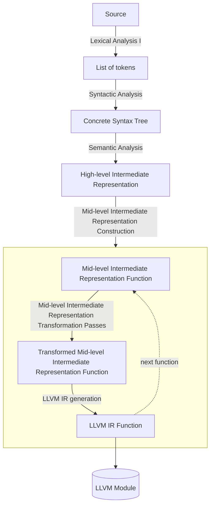

<div align="center">
  
  <h1>blueberry</h1>
  <p>simple and expressive programming language</p>
</div>

> [!CAUTION]
> The compiler can't compile blueberry programs yet.

## Installation

### Requirements

- Rust
- LLVM 22

### Building from Source

1. Git clone the repository

```sh
git clone https://github.com/simontran7/blueberry.git
```

2. `cd` into the `blueberry/` directory 

```sh
cd blueberry/
```

3. Build

```sh
cargo build --release
```

4. Move the `target/release/blueberry` binary to a desired location (e.g. in `/Users/<username>`), then add it to your `PATH` by adding the following line to your `.bashrc` file

```sh
# in your .bashrc
export PATH=$PATH:<path to the compiler executable>
```

## Usage

Run `blueberry --help` to see available commands and options.

## Architecture



## Language Reference

See [A Tour of Blueberry](docs/tour-of-blueberry.md).
