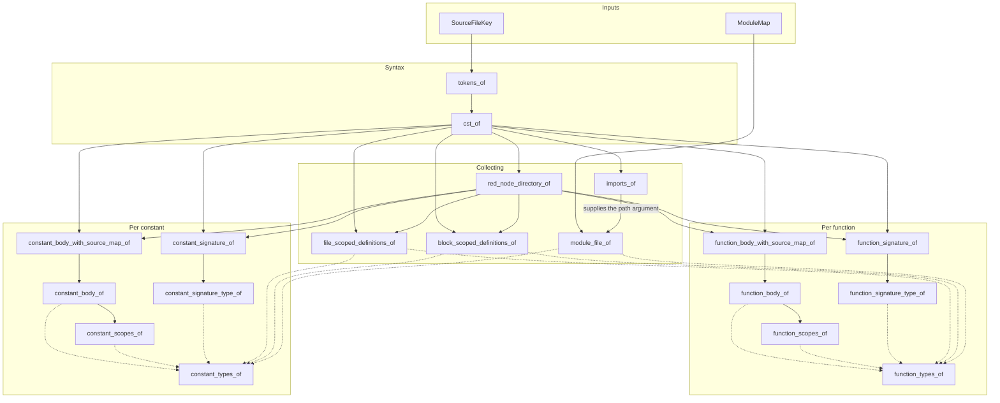
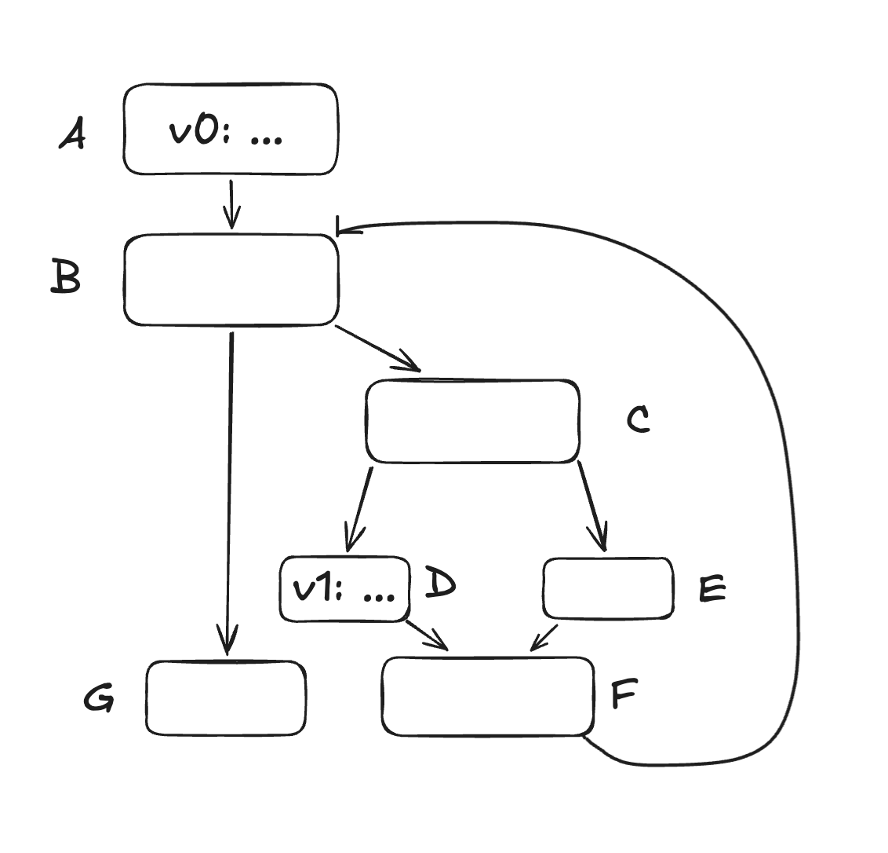
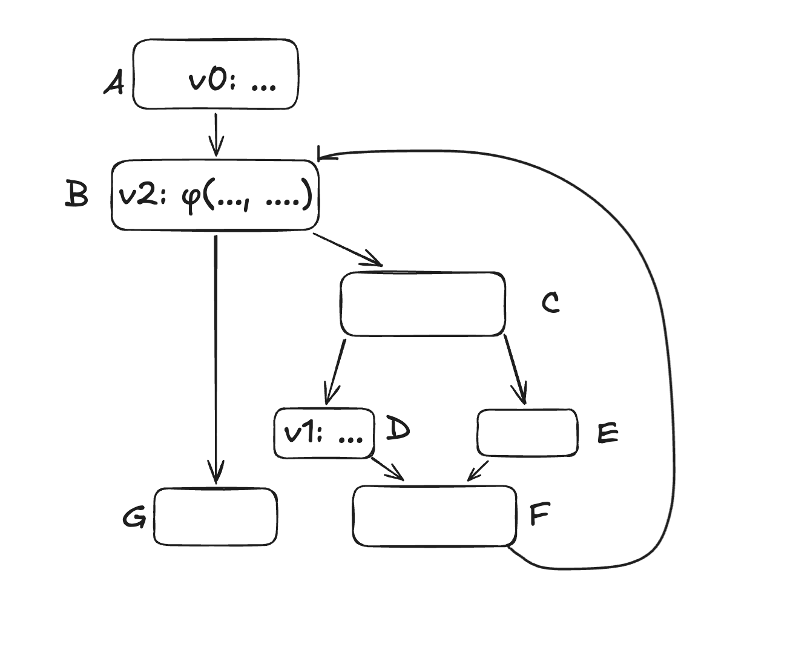
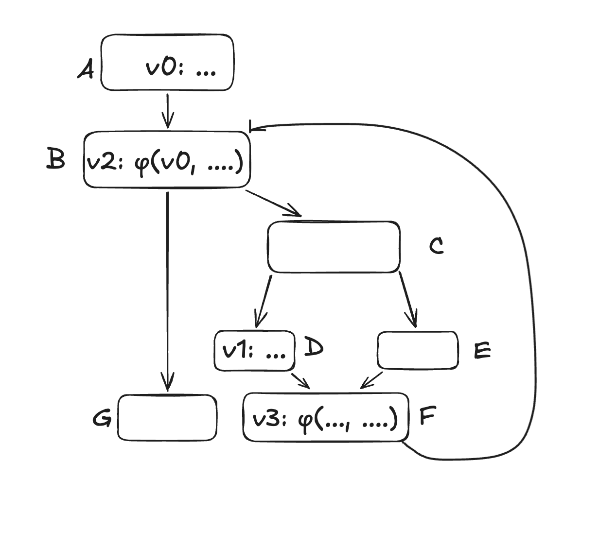
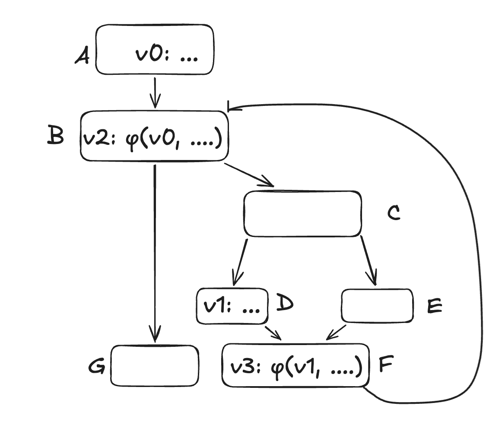
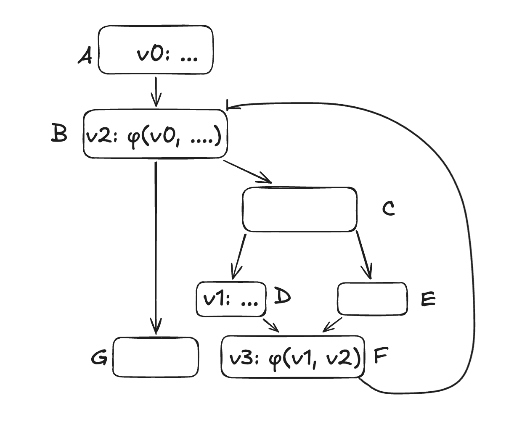
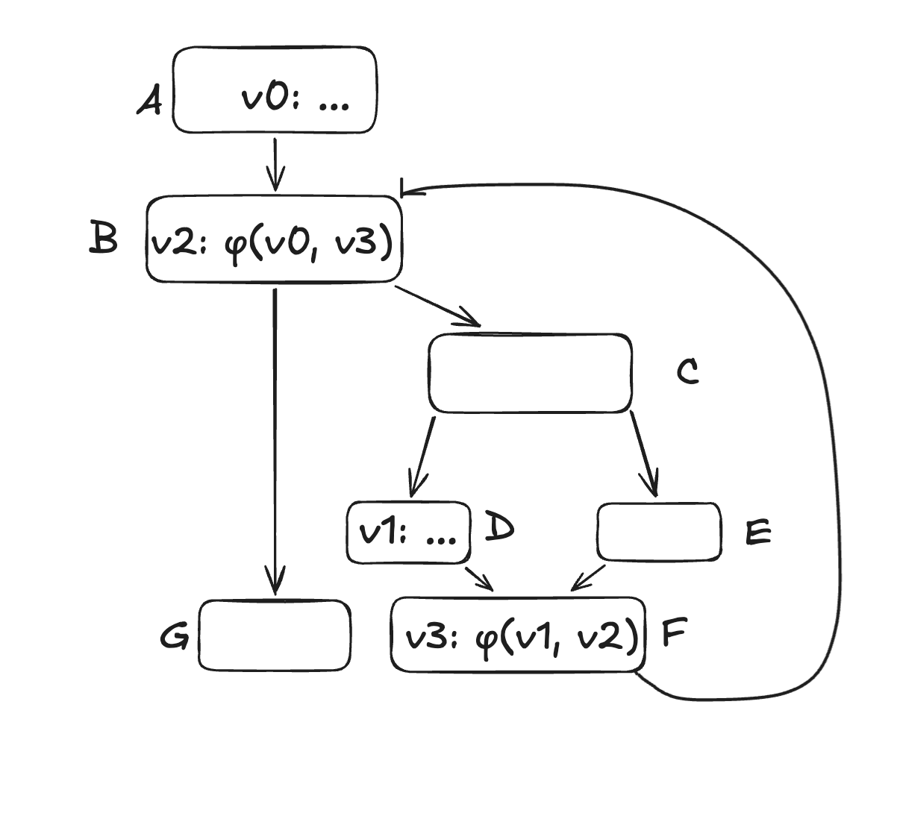

<div align="center">
  
  <h1>blueberry</h1>
  <p>simple and expressive programming language</p>
</div>

## Installation

### Requirements

- Rust
- LLVM 22

### Building from Source

1. Git clone the repository

```sh
git clone https://github.com/simontran7/blueberry.git
```

2. Change directory 

```sh
cd blueberry/
```

3. Build

```sh
cargo build --release
```

4. Move the `target/release/blueberry` binary to a desired location (e.g. in `/Users/<username>`), then add it to your `PATH` by adding the following line to your `.bashrc` file

```sh
# in your .bashrc
export PATH=$PATH:<path to the compiler executable>
```

## Usage

Run `blueberry --help` to see available commands and options.

## Language Reference

See [A Tour of Blueberry](docs/tour-of-blueberry.md).

## Architecture

The compiler core is based on the [**query-based architecture**](https://ollef.github.io/blog/posts/query-based-compilers.html). 

Queries are memoized thanks to [salsa](https://github.com/salsa-rs/salsa).

While the language server calls the queries depending on the interactions, the batch compiler calls the queries as follows:


```mermaid
flowchart TD
    subgraph inputs [Inputs]
        SourceFileKey
        ModuleMap
    end

    subgraph syntax [Syntax]
        tokens_of
        cst_of
    end

    subgraph collect [Collecting]
        red_node_directory_of
        file_scoped_definitions_of
        block_scoped_definitions_of
        imports_of
        module_file_of
    end

    subgraph function [Per function]
        function_signature_of
        function_signature_type_of
        function_body_with_source_map_of
        function_body_of
        function_scopes_of
        function_types_of
    end

    subgraph constant [Per constant]
        constant_signature_of
        constant_signature_type_of
        constant_body_with_source_map_of
        constant_body_of
        constant_scopes_of
        constant_types_of
    end

    SourceFileKey --> tokens_of --> cst_of
    cst_of --> red_node_directory_of

    cst_of & red_node_directory_of --> file_scoped_definitions_of
    cst_of & red_node_directory_of --> block_scoped_definitions_of
    cst_of --> imports_of

    ModuleMap --> module_file_of
    imports_of -- "supplies the path argument" --> module_file_of

    cst_of & red_node_directory_of --> function_signature_of
    function_signature_of --> function_signature_type_of
    cst_of & red_node_directory_of --> function_body_with_source_map_of
    function_body_with_source_map_of --> function_body_of --> function_scopes_of

    cst_of & red_node_directory_of --> constant_signature_of
    constant_signature_of --> constant_signature_type_of
    cst_of & red_node_directory_of --> constant_body_with_source_map_of
    constant_body_with_source_map_of --> constant_body_of --> constant_scopes_of

    function_body_of & function_scopes_of & function_signature_type_of -.-> function_types_of
    constant_body_of & constant_scopes_of & constant_signature_type_of -.-> constant_types_of

    file_scoped_definitions_of & block_scoped_definitions_of & module_file_of -.-> function_types_of
    file_scoped_definitions_of & block_scoped_definitions_of & module_file_of -.-> constant_types_of
```

### Lexical Analysis

TO WRITE

### Syntactic Analysis

TO WRITE 

Recursive descent parsing works remarkably well for parsing statements and declarations, but less so for expressions. This is because parsing expressions is tricky to get right: the parser must parse according to the language's **operator precedence** (which determines how tightly operators bind to their operands when multiple operators appear together) and **operator associativity** (which determines how operands are grouped when multiple operators of the same precedence level appear in sequence). For instance, consider the expression $8 - 4 - 2$: with left associativity, it becomes $(8 - 4) - 2 = 2$, but with right associativity, it becomes $8 - (4 - 2) = 6$. In programming languages, most arithmetic operators are left-associative (addition, subtraction, multiplication, division), while assignment and exponentiation are typically right-associative.

To cleanly parse expressions, we can use a clever technique called **Top-down Operator Parsing**, also known as **Pratt Parsing**.

At its core, Pratt parsing assigns each operator an integer called a **binding power** for each side that has an operand. An operator may have a left binding power, used to bind any operands on its left, and a right binding power, used to bind any operands on its right. An infix operator has a left binding power, and a right binding power, a prefix operator only has a right binding power, and a postfix operator only has a left binding power.

Operator precedence is encoded in the magnitude of binding powers: the higher the precedence, the higher the binding power. When an operand has operators on either side, it binds to the one with the higher binding power.

When infix operators of equal precedence are chained (e.g., as in `a + b - c`, where `b` is caught between `+` and `-` with equal operator precedence), an ambiguity arises: should `b` bind left, giving `(a + b) - c`, or right, giving `a + (b - c)`? This ambiguity is unique to infix operators, since prefix operators only have an operand on their right and postfix operators only on their left, so there is never a competition between two operators over the same operand. This is where associativity comes in. Left-associative operators group from the left - `a + b - c` becomes `(a + b) - c` - while right-associative operators group from the right, so `a ** b ** c` becomes `a ** (b ** c)`. To enforce this in Pratt parsing, each infix operator is assigned an asymmetric pair of binding powers. For a left-associative operator, the right binding power is set slightly higher than the left, pulling the contested operand toward the left operator. For a right-associative operator, the left binding power is set slightly higher, pulling the operand right.

The following depicts the relationship between operator precedence and binding power (from low to high) for the basic arithmetic operators:

```text
operator      precedence    associativity    left bp    right bp
──────────────────────────────────────────────────────────────
- (unary)     highest       N/A                -           6
**            high          right              5           4
*, /          high          left               3           4
+, -          low           left               1           2
= (assign)    lowest        right              1           0
```

Pratt parsing occurs in the `parse_expression()`, and boils down to the following:

```text
func parse_expression(min_bp) {
    lhs = nud()

    while peek().left_bp > min_bp {
        operator = advance()
        rhs = parse_expression(operator.right_bp)
        lhs = InfixExprNode(operator, lhs, rhs)
    }

    return lhs
}
```

Intuitively, Pratt parsing builds an imaginary right-leaning spine while each successive operator binds strictly tighter than the last (`peek().left_bp > min_bp`). As soon as an operator breaks this monotonically increasing streak, the recursion unwinds back up the spine until it locates the frame - and therefore the position in the tree - where that operator belongs.

The line `lhs = nud()` parses the first token with no left context. The `nud()` function creates nodes for literals, unary operations, grouped expressions, and so on.

The while loop is the mechanism that builds the monotonically increasing streak of operators. If the current operator's left binding power is strictly greater than `min_bp`, we advance past the operator and recurse for its right-hand side, passing in the operator's right binding power as the next `min_bp`.

```text
operator = advance()
rhs = parse_expression(operator.right_bp)
```

This is why the condition checks the *left* binding power: since the parser processes tokens left to right, each operand sits between two operators - the one that came before it and the one that comes after. These two operators compete for that operand. The previous operator pulls using its right binding power, and the current operator pulls using its left binding power, and so, they face each other across the operand. `min_bp` carries the previous operator's right binding power into the recursive call, so `peek().left_bp > min_bp` is really asking: "does the current operator bind this operand more tightly than the previous one?"

When `peek().left_bp <= min_bp`, we return `left`. For a barebone expression like a literal, we never recurse in the first place, so this simply returns the atom itself. But for infix expressions, returning `left` pops a stack frame off the call stack, handing the subtree back to a parent frame whose while loop can then locate where the next operator belongs in the tree - effectively unwinding up an imaginary right-leaning spine (created by increasing precedence) until we reach a frame whose `min_bp` is low enough to claim the operator. Everything the recursion built on the way down - every subtree handed back through those popped frames - becomes the left child of that operator.

The main change is breaking the while loop paragraph into two: one for *what* it does (with the code snippet right there), and a separate one for *why* it checks left binding power. This keeps the code-intuition interleaving without burying the explanation in a parenthetical.

**Example**: Consider the expression `a > b + c * d == e`.

```text
Frame 1: parse_expression(0)
peek(): `>`
min_bp: 0

Because peek().left_bp > min_bp, we recurse

   >
  / \
 a   ?
```

```text
Frame 2: parse_expression(`>`.right_bp)
peek(): `+`
min_bp: `>`.right_bp

Because peek().left_bp > min_bp, i.e., `+`.left_bp > `>`.right_bp we recurse

     +
    / \
   b   ?
```

```text
Frame 3: parse_expression(`+`.right_bp)
peek(): `*`
min_bp: `+`.right_bp

Because peek().left_bp > min_bp, i.e., `*`.left_bp > `+`.right_bp, we recurse

       *
      / \
     c   ?
```

```text
Frame 4: parse_expression(`*`.right_bp):
peek(): `==`
min_bp: `*`.right_bp

Because peek().left_bp < min_bp i.e., `==`.left_bp < `*`.right_bp, we return the following node and pop this frame

d
```

```text
Frame 3: parse_expression(`+`.right_bp)
peek(): `==` (now at `==` because of frame 4!)
min_bp: `+`.right_bp

Node is now:

       *
      / \
     c   d (leaf from frame 4)

Because peek().left_bp < min_bp i.e., `==`.left_bp < `+`.right_bp, we return the following node and pop this frame

       *
      / \
     c   d (leaf from frame 4)
```

```text
Frame 2: parse_expression(`>`.right_bp)
peek(): ==
min_bp: `>`.right_bp

Node is now:
     +
    / \
   b   *
      / \
     c   d

Because peek().left_bp < min_bp i.e., `==`.left_bp < `>`.right_bp, we return the following node and pop this frame

     +
    / \
   b   *
      / \
     c   d
```

```text
Frame 1: parse_expression(0)
peek(): `==`
min_bp: 0

Node is now:
   >
  / \
 a   +
    / \
   b   *
      / \
     c   d

And because peek().left_bp > min_bp i.e., `==`.left_bp > 0, we recurse

      ==
     /  \
    >    ?
   / \
  a   +
     / \
    b   *
       / \
      c   d
```

```text
Frame 5: parse_expression(`==`.right_bp)
peek(): `EOF`
min_bp: `==`.right_bp

`EOF` has no binding power, so we return the following node and pop this frame

e
```

```text
Frame 1: parse_expression(0)
peek(): `EOF`
min_bp: 0

Node is now:
      ==
     /  \
    >    e
   / \
  a   +
     / \
    b   *
       / \
      c   d

`EOF` has no binding power, so the while loop exits. Return the following node and pop this frame

      ==
     /  \
    >    e
   / \
  a   +
     / \
    b   *
       / \
      c   d
```

Lastly, the initial call being `parse_expression(0)` because `0` is the lowest possible binding power, which allows every operator to pass the `bp(peek()) > 0` check, and thus ensures the outermost stack frame can `bump()` any operator it encounters.

> [!NOTE]
> We use a `while` instead of an `if` so that after a recursive call returns, the frame re-checks whether the next operator still passes `peek().left_bp > min_bp`. Without it, each frame could only claim one operator before returning, which means operators that unwind back to that frame's precedence level would be abandoned.

> [!NOTE]
> Top-down operator precedence (a.k.a. Pratt parsing) is similar to precedence climbing and the Shunting Yard. Pratt differs from precedence climbing in that the latter uses a precedence table while the former uses explicit binding powers. The Shunting Yard algorithm differs from Pratt parsing through the use of an explicit stack, rather than the implicit call stack used in Pratt parsing.

### Semantic Analyis

**Semantic analysis** covers four concerns:
- **Collecting**: determine what names exist and where (which definitions a file declares, which locals are visible in a scope, which modules a file imports).
- **Lowering**: convert syntax tree into the HIR.
- **Resolving**: given one specific _occurrence_ of a name, decide which declaration it points to.
- **Type checking**: inferring and checking the types of expressions.

A definition or block needs an identity that survives edits elsewhere in the file so that unrelated changes don't invalidate its cached signature, body, or type. 

`RedNodeId`/`RawRedNodeId` (in `red_node_directory.rs`) implement this as a tree-path scheme: `(file, parent, kind, name, collision_index)`. Two same-named siblings (e.g. two anonymous blocks) get distinct ids via the collision index, and inserting an unrelated definition elsewhere in the file leaves every other id untouched. `RedNodeDirectory` is the per-file table mapping an id to its current tag (kind + span), rebuilt on every parse. `to_ast_node` walks from the file's root back down to the concrete node an id currently refers to.

Every identifier needs to be resolved to the declaration it refers to. These identifiers, are interned via `Symbol`, and are 
stored in three different data structures depending on where they live:
- `ScopeTree`: stores local names for any definition body
- `DefinitionTree`: stores definitions for any file or for any block
- `Vec<Path>`: stores the HIR paths for any file

Blueberry's type checker follows the **bidirectional typing** technique (Dunfield & Krishnaswami, [*Bidirectional Typing*](https://arxiv.org/abs/1908.05839)) which involves two core modes:
- **Checking Mode (`check(expression, ty)`)**: the expected type `ty` is known and _pushed down_ as an argument. This mode runs when the context provides a type (e.g. function return positions, explicit annotations, `const` values, call arguments, etc.). It is also preferred because it produces better-localized error messages ([source](https://jaked.org/blog/2021-09-07-Reconstructing-TypeScript-part-0#:~:text=One%20way%20this%20makes%20the%20type%20checker%20more%20usable%20is%20by%20localizing%20errors.)).
- **Inference Mode (`infer(expression)`)**: the type is _infered_ from the expression's structure alone. This mode runs when no expected type is known. Type inference involves generating and solving **constraints**. 

In both modes, each HIR node is assigned a type, which may be fully concrete (e.g. `I32`), a fresh **unification variable** created via `make_general_var()` or `make_int_var()` when nothing is yet known, or a compound type containing unification variables (e.g. `List[?a]` means the node is definitely a list, but the element type is unknown). 

solves the constraints by finding a **substitution** (a mapping from each unification variable to a concrete type) that satisfies all equality constraints simultaneously. Each constraint is solved by calling `.unify()`, which implements Robinson's unification algorithm.

Before unifying, the semantic analyzer calls `.shallow_resolve()` on each side:

1. If the type is concrete (e.g. `I32`, `Bool`), return it immediately.
2. If the type is a unification variable, call `find` on the unification table to locate the representative.
3. If the representative has a concrete slot, recurse on it. Otherwise, intern the root variable as a `TypeId` and return it.

After shallow-resolving both sides, dispatch on their shapes:

| `expected` | `actual` | action |
|---|---|---|
| inference var | inference var | merge their equivalence classes |
| inference var | concrete type | pin the variable to the concrete type |
| concrete type | inference var | pin the variable to the concrete type |
| concrete type | concrete type | verify they are equal; emit `TypeMismatch` if not |

When generics and compound types arrive (e.g. `Func(A, B)`), unification will also need to recurse into subterms and add an **occurs check** to reject infinite types like `?a = List<?a>`.

```rust,ignore
pub enum Constraint {
    Equality { expected: TypeId, actual: TypeId, provenance: Provenance },
}
```

`Provenance` records where the constraint came from, carrying enough information to emit a precise diagnostic if unification later fails.

every unification variable has been resolved. However, the HIR still holds placeholder from phase 1. Phase 3 walks the HIR and replaces every placeholder with its resolved concrete type via `shallow_resolve`, covering expression nodes and local bindings. Item bindings never hold inference variables since `.collect_item_definition()` always resolves their types from explicit annotations.

Unresolved fallbacks:
- `IntVar` defaults to `I32`
- `TyVar` becomes `error_id`

Once inside a body, the walk needs to answer "what's the type of this _reference_ to a name" e.g. hitting a `Path` expression for a parameter or a `let`-bound local. That's the job of a **type environment**: a map from a variable to its type, consulted every time the walk crosses a reference to it.

### HIR Lowering

The [initial SSA construction algorithm](https://dl.acm.org/doi/pdf/10.1145/75277.75280) accepts a CFG as input, and works as follows:
1. Computes for every block $X$ in the CFG its **dominance frontier** $DF$. A dominance frontier is the set of all blocks $Y$ where $X$ dominates one of its predecessors, *but* $X$ does *not* dominate $Y$. 

For instance: in the following CFG, $DF(B) = {D}$ (i.e., the dominance frontier of block $B$ is only $D$) since $D$'s predecessor $E$ is dominated by $B$, yet $B$ does not dominate $D$ since there's a path to $D$ from $C$.

```text
   / \
  B   C
  |   |
  E   |
   \ /
    D
```

2. For each variable, find every block that contains an assignment of it, union their dominance frontiers, then put a φ-node in each block of that union. This is because every block in a dominance frontier is a merge point! 

> [!NOTE]
> Facts about dominances
> - A block $A$ is said to dominate a block $B$ if every path from the entry block of the CFG to block $B$ passes through block $A$. A block $A$ strictly dominates a block $B$ if the block $A$ dominates block $B$ and $A \neq B$
> - Every block dominates (but does not strictly dominate) itself.

This indicates where to create and insert phi nodes.

3. Rename variables to ensure SSA's single assignment property is satisfied.

However, Cytron et al.'s algorithm pays two costs before a single phi node is placed: the AST must already be lowered to a CFG, and the dominance frontier (typically alongside the dominator tree) must be computed for the *entire* CFG upfront, regardless of how many variables actually need phi nodes. 

This is where [Braun et al.'s algorithm](https://link.springer.com/chapter/10.1007/978-3-642-37051-9_6) comes in. It lowers straight from the typed IR to SSA (skipping the dominance frontier analysis entirely from Cytron et al.'s algorithm), by placing phi nodes lazily via recursion instead of computing them all upfront:
- Base Case (**Local value numbering**): check if the variable was already assigned earlier in the same block, and if so, just reuse that value directly (since there's only ever one possible path that led to that assignment executing: the one you're already on)
- Recursive Step (**Global value numbering**): if a block currently contains no definition for a variable, we recursively look for a definition in its predecessors. Which of three cases applies depends on the block's sealed status and predecessor count:
    - **Unsealed** (not all predecessors known yet): create an empty phi node for this block as a placeholder.
    - **Sealed, single predecessor**: skip creating a phi node entirely, and just query that one predecessor recursively for a definition instead since there's only one possible path into this block, and so there's nothing to merge.
    - **Sealed, multiple predecessors**: create an empty phi node for this block first to prevent infinite recursion (the placeholder is what a reentrant lookup for the same block finds instead of recursing forever, breaking the cycle), record it as the current definition for the variable in the block, then recurse into every predecessor and ask each for their value.
        - If all predecessors give the same value: no phi node is needed at all. That single value is the answer, and just hand it back up.
        - If the predecessors give different values: that disagreement means this block is a genuine merge point, so the placeholder phi node's operands get filled in, one operand per predecessor, matching each predecessor's value to its corresponding edge. The phi node's result value becomes the answer.
        - Then, check whether that phi node is *trivial* i.e., if its operands, once filled in, all turn out to be the same value (ignoring any operand that just points back to the phi node itself), and thus, not merging anything. This phi node is therefore removed, and every use of it is replaced with that shared value directly. Additionally, a phi node is considered trivial if the phi node has no operands besides itself, it means that it can't actually be reached with from any predecessor (i.e., it's either dead/unreachable code, or it's the function's entry block, as the entry block has no predecessors at all) either unreachable or in the start block. Since there's nothing sensible to substitute, we plug in an explicit **undefined** placeholder value as the phi node's replacement, so it takes the phi node's place wherever the phi was already being used. 

> [!NOTE]
> Sealing (`declare_block` then, later, `seal_block`) is an explicit, caller-driven action: seal a block the moment its predecessor set is final. Most blocks know that upfront and seal immediately, but loop headers don't, since the back-edge doesn't exist until the whole body is lowered, so sealing waits until then.

> [!NOTE]
> This fill-then-check order only stays cheap for classical phi nodes whose operands live on the phi node itself. For **block parameters**, operands instead live on each predecessor's jump or branch instruction as block arguments, so filling them in *before* checking triviality means a trivial result leaves the block's parameter count out of sync with its predecessors' argument count, forcing the one argument added to be stripped back out of every predecessor. Cranelift avoids this by checking triviality first, before writing any arguments, and only committing them once a parameter is known to survive (i.e., there's no process of removing block arguments).

> [!NOTE]
> It is necessary to *recursively* remove trivial phi nodes as other phi nodes elsewhere may hold the now-deleted trivial phi node as one of their operands. Once that operand is rewritten to the common value $v$, those phis' operand lists change too, which can newly make *them* trivial so the check has to cascade to every user of the removed phi, and not *just* the phi itself. However, this code doesn't do that, but only **aliases** trivial block parameters, then rewrites them once, in a single batch at the end of construction (`flush_aliases()`). 

Consider the following blueberry source program:

```
let x = ...;
while ... {
    if ... {    
        x = ...;
    }   
}
println(x);
```

Braun's algorithm would tackle the SSA construction as follows (assuming the loop is constructed before `x` is read):

1. `let x = ...;` and `x = ...;` are both simple assignments. We record for `let x = ...;` as `v0`, and `x = ...;` inside the if expression as `v1`.



2. For `println(x);`, it does not contain a local definition of `x`, so we recurse upwards to its single predecessor block $B$ (this is example of the fast path executing), requesting for the definition of `x`.

3. Now at block $B$, we check if it has a local definition of `x`. It does not. But block $B$ has two predecessors: block $A$ (entering the loop the first time) and block $F$ (coming back around after one iteration). With no location definition in the current block $B$, but two predecessors, it is a merge point, so we create an empty phi node labeled $v2$ for the block $B$, and immediately register $v2$ as block $B$'s current definition of `x`. Then, we recurse into block $B$'s two predecessors to fill in $v2$'s operands.



4. In block $A$, there exists a local definition of `x` labeled $v0$ (created in step 1) and return $v0$ so that it may become $v2$'s first operand. In block $F$, there are no local definitions of `x`, but block $F$ has two predecessors: block $D$ and block $E$. This signals that it also a merge point, and so, we create an empty phi node $v3$, and register it as block $F$'s local definition of `x`. We now recurse into block $F$'s predecessors (block $D$ and block $E$).



5. In block $D$, there is a local definition of `x` labeled $v1$ (created in step 1), so we return $v1$ so that it may become $v3$'s first operand. In block $E$, there are unfortunately no local definitions of `x`. It does have one predecessor: block $C$, so we don't need to create a phi node, and we recurse into block $C$.



6. In block $C$, it also has no local definitions of `x`, but it has one predecessor: block $B$, so we recurse once more without having to create a phi node.
7. In block $B$, we finally see a local definition of `x` labeled $v2$, which was created in step 3. Had we not created that empty phi node, we would have done recurse down the same path, on and on, recursing infinitely! We return $v2$ thrice back down to the stack frame created in step 4 so that it may become $v3$'s second operand.



8. In the current stack frame for step 4, we perform another return to pass down $v3$ — a filled phi node with operands $v1$ and $v2$ — as a second operand of the phi node $v2$ created in step 3.



9. We now have completed block B's $v2$ phi node. It has as first operand $v0$, and as second operand $v3$.

> [!NOTE]
> Since this Braun et al's algorithm doesn't build a dominance frontier, any later pass that may require one (e.g. loop-invariant code motion, contification) must compute it separately, which isn't much different than the upfront dominance frontier compute cost of Cytron et al. algorithm.

> [!NOTE]
> Braun et al.'s algorithm also enables on-the-fly local optimizations (constant folding, copy propagation, common subexpression elimination) during construction, since values are built incrementally anyway.


