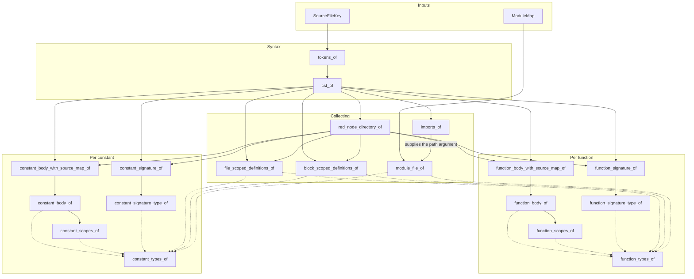

<div align="center">
  
  <h1>blueberry</h1>
  <p>simple and expressive programming language</p>
</div>

## Installation

### Requirements

- Rust
- LLVM 22

### Building from Source

1. Git clone the repository

```sh
git clone https://github.com/simontran7/blueberry.git
```

2. Change directory 

```sh
cd blueberry/
```

3. Build

```sh
cargo build --release
```

4. Move the `target/release/blueberry` binary to a desired location (e.g. in `/Users/<username>`), then add it to your `PATH` by adding the following line to your `.bashrc` file

```sh
# in your .bashrc
export PATH=$PATH:<path to the compiler executable>
```

## Usage

Run `blueberry --help` to see available commands and options.

## Language Reference

See [A Tour of Blueberry](docs/tour-of-blueberry.md).

## Architecture

The compiler core is based on the [**query-based architecture**](https://ollef.github.io/blog/posts/query-based-compilers.html). 

Queries are memoized thanks to [salsa](https://github.com/salsa-rs/salsa).

While the language server calls the queries depending on the interactions, the batch compiler calls the queries as follows:


```mermaid
flowchart TD
    subgraph inputs [Inputs]
        SourceFileKey
        ModuleMap
    end

    subgraph syntax [Syntax]
        tokens_of
        cst_of
    end

    subgraph collect [Collecting]
        red_node_directory_of
        file_scoped_definitions_of
        block_scoped_definitions_of
        imports_of
        module_file_of
    end

    subgraph function [Per function]
        function_signature_of
        function_signature_type_of
        function_body_with_source_map_of
        function_body_of
        function_scopes_of
        function_types_of
    end

    subgraph constant [Per constant]
        constant_signature_of
        constant_signature_type_of
        constant_body_with_source_map_of
        constant_body_of
        constant_scopes_of
        constant_types_of
    end

    SourceFileKey --> tokens_of --> cst_of
    cst_of --> red_node_directory_of

    cst_of & red_node_directory_of --> file_scoped_definitions_of
    cst_of & red_node_directory_of --> block_scoped_definitions_of
    cst_of --> imports_of

    ModuleMap --> module_file_of
    imports_of -- "supplies the path argument" --> module_file_of

    cst_of & red_node_directory_of --> function_signature_of
    function_signature_of --> function_signature_type_of
    cst_of & red_node_directory_of --> function_body_with_source_map_of
    function_body_with_source_map_of --> function_body_of --> function_scopes_of

    cst_of & red_node_directory_of --> constant_signature_of
    constant_signature_of --> constant_signature_type_of
    cst_of & red_node_directory_of --> constant_body_with_source_map_of
    constant_body_with_source_map_of --> constant_body_of --> constant_scopes_of

    function_body_of & function_scopes_of & function_signature_type_of -.-> function_types_of
    constant_body_of & constant_scopes_of & constant_signature_type_of -.-> constant_types_of

    file_scoped_definitions_of & block_scoped_definitions_of & module_file_of -.-> function_types_of
    file_scoped_definitions_of & block_scoped_definitions_of & module_file_of -.-> constant_types_of
```

Each stage is explained in its own document:
- See [Syntactic Analysis](docs/syntactic-analysis.md) for how source text becomes a concrete syntax tree.
- See [Semantic Analysis](docs/semantic-analysis.md) for how the concrete syntax tree is lowered to an high-level intermediate representation form, how names are resolved, and how types are inferred and checked.
- See [HIR Lowering](docs/hir-lowering.md) for how the HIR is lowered to a mid-level intermediate representation.
